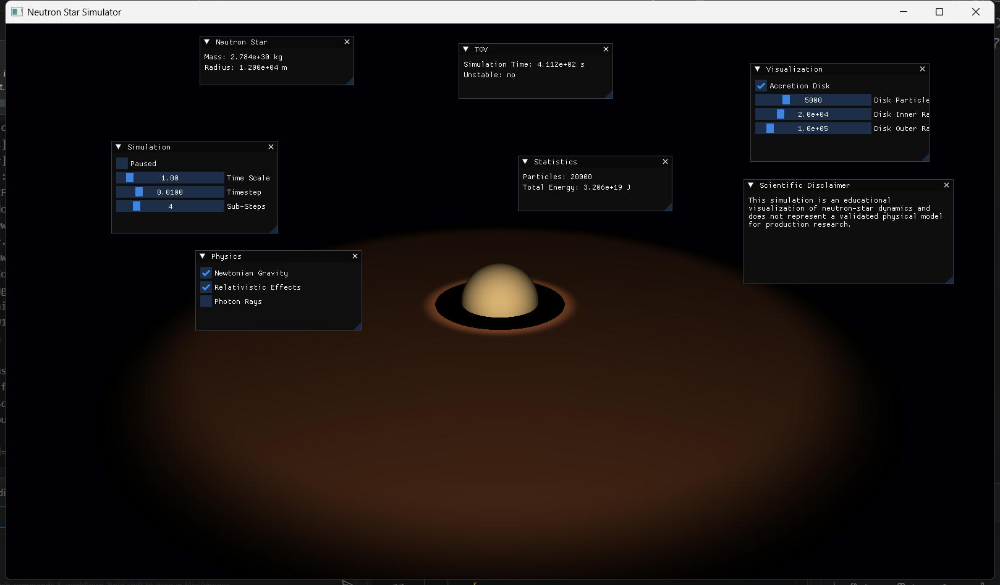
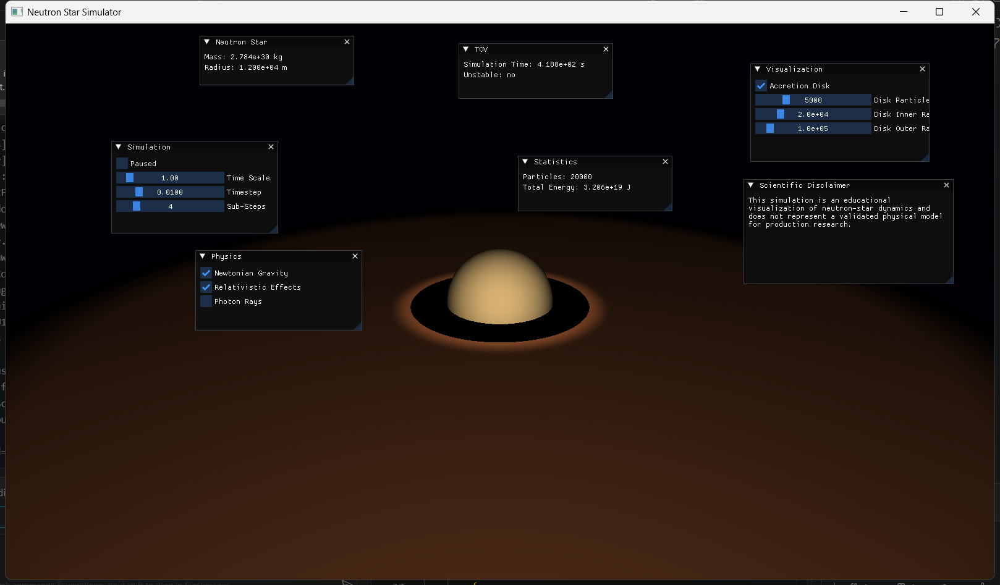

# Neutron Star Simulator


An interactive, real-time neutron star simulator: a 1.4 M☉ star wrapped in a particle-based accretion disk, driven by three numerical integrators and a Tolman–Oppenheimer–Volkoff stellar-structure solver. Every value on screen maps directly onto the physics — render it with raw OpenGL 4.6 and steer it live from a Dear ImGui control room.


## ✨ Highlights

**Implemented**

- 🌀 **Particle accretion disk** — circular-orbit initialization, temperature gradient, viscous inward drift
- 🧮 **Euler, Verlet and RK4 integrators** with sub-stepping, velocity capping and instability detection
- ⚖️ **TOV solver** — relativistic stellar structure on a polytropic equation of state
- 🌟 **HDR rendering** — `RGBA16F` offscreen framebuffer with a blit present pass
- 🖥️ **Live control room** — seven ImGui panels driving every parameter mid-flight
- ⚡ **OpenMP-parallel** particle physics (optional build flag)

**In development** 🚧

- Particle point rendering — 20,000 particles simulated on the CPU, not drawn yet
- Photon-ray visualization
- ImPlot mass–radius curves

## 📸 Screenshots

| Orbit view (default) | Zoomed in on the star & inner disk |
|---|---|
|  |  |

*Captured directly from the running application (Windows, OpenGL 4.6).*

## 🏗️ Architecture

```
┌──────────┐   ┌─────────────┐   ┌─────────────┐   ┌──────────────┐
│ Physics  │──▶│  Simulation │──▶│  Rendering  │◀──│   UI (ImGui) │
│ pure math│   │ state + step│   │ GL + HDR FBO│   │ reads / drives│
└──────────┘   └─────────────┘   └─────────────┘   └──────────────┘
```

| Layer | Responsibility | Folder |
|---|---|---|
| **Physics** | Gravity, relativity, rotation, EOS, TOV — *pure math, no OpenGL* | `include/Physics`, `src/Physics` |
| **Simulation** | Owns the star, 20,000-particle pool, accretion disk and all parameters; advances state per sub-step | `Simulation` |
| **Rendering** | GL resources, HDR framebuffer, meshes and shaders — reads simulation state, never mutates it | `Rendering` |
| **UI** | ImGui panels — write parameters, read state for display | `UI` |

Each frame: poll input → `simulation.step()` × sub-steps → render scene → ImGui frame → present. Because the physics layer depends on nothing but GLM, it is fully unit-testable without a GPU — which is exactly what the test suite does.

## 🔭 Physics Model

**Physical constants (SI units)**

| Constant | Value |
|---|---|
| Gravitational constant | `G  = 6.67430×10⁻¹¹ m³ kg⁻¹ s⁻²` |
| Speed of light | `c  = 299 792 458 m/s` |
| Solar mass | `M☉ = 1.98847×10³⁰ kg` |
| Default star | `M = 1.4 M☉`, `R = 12 km` |

**Implemented physics**

| Phenomenon | Model |
|---|---|
| Newtonian gravity | `g(r) = GM/r²`,  `Φ(r) = −GM/r` |
| Escape velocity | `v_esc = √(2GM/r)` |
| Schwarzschild radius | `r_s = 2GM/c²` |
| Compactness | `C = 2GM/(Rc²)` |
| Gravitational time dilation | `dτ/dt = √(1 − 2GM/rc²)` |
| Gravitational redshift | `z = 1/√(1 − 2GM/rc²) − 1` |
| Rotational velocity | `v = ωr` |
| Equation of state | Polytropic `P = Kρ^γ` |
| Stellar structure | TOV equations integrated numerically (`src/Physics/TOVSolver.cpp`) |

**Particle dynamics** — disk particles start on circular orbits (`v_orb = √(GM/r)`) with a `T(r) = T₀√(r_in/r)` temperature gradient, drift inward under a viscosity approximation, are deactivated if they fall inside the star, capped at `0.5 c`, and any non-finite state raises the instability flag in the **TOV** panel.

## 🎮 Interactive Controls

### Mouse

| Input | Action |
|---|---|
| **Left-drag** | Orbit the camera around the star |
| **Middle-drag** | Pan the view target |
| **Scroll wheel** | Zoom (orbit radius clamped to 10–1000 world units) |
| *Over UI panels* | Camera input is suppressed — safe to drag sliders |

### Keyboard

| Key | Action |
|---|---|
| `Space` | Pause / resume the simulation |
| `R` | Reset the camera to the default orbit |
| `M` | Toggle orbit / free-fly camera |
| `W` `A` `S` `D` | Free-fly movement |
| `Q` / `E` | Free-fly down / up |
| `Esc` | Quit |

> **World scale:** 1 world unit = 1 km. The star (radius 12 km) sits at the origin; the camera starts on a 150 km orbit.

## 🖥️ GUI Panels

All panels are movable, resizable and closable; the layout persists in `imgui.ini` — delete that file to restore the default.

| Panel | Purpose |
|---|---|
| **Scientific Disclaimer** | Educational-use notice shown at startup. |
| **Simulation** | Pause/resume and steer the clock — time scale, timestep, sub-stepping. |
| **Physics** | Toggle Newtonian gravity, relativistic effects, photon rays and the accretion disk. |
| **Neutron Star** | Live mass and radius of the star. |
| **TOV** | Simulation clock and the numerical-instability flag. |
| **Visualization** | Disk on/off, particle count, inner/outer disk radii — the rendered annulus reshapes live. |
| **Statistics** | Particle pool usage and total mechanical energy. |

## 🎨 Rendering Pipeline

```
GLFW window (1600×900, GL 4.6 core, vsync)
        │
        ▼
┌─────────────────────────────────────────────┐
│  Offscreen HDR framebuffer (RGBA16F + D24S8)│
│                                             │
│   ★ Star mesh  (48×24 sphere; diffuse +     │
│      limb brightening)                      │
│                                             │
│   🌀 Disk mesh  (annulus; camera-light      │
│      diffuse, inner-edge boost, outer fade) │
└─────────────────────────────────────────────┘
        │  glBlitFramebuffer (linear)
        ▼
   Default framebuffer → Dear ImGui overlay
```

- OpenGL loaded with **GLAD** (vendored); math by **GLM**; logging by **spdlog**
- Back-face culling and depth testing on — mesh windings are CCW-outward
- GLSL 460 shaders under `assets/shaders/`, auto-located relative to the working directory or executable

## 🚀 Getting Started

### Requirements

- **CMake 3.20+** and a **C++20** compiler (MSVC 2022, MinGW-w64, GCC 13+, or Clang)
- **OpenGL 4.6** capable GPU and current drivers
- Everything else is fetched automatically by CMake `FetchContent`: GLFW 3.4 · GLAD (vendored) · GLM 1.0.1 · Dear ImGui 1.91.5 · ImPlot 0.16 · spdlog 1.14.1 · stb_image · OpenMP (optional)

### Build

```bash
# Windows (MSVC) / Linux
cmake -S . -B build
cmake --build build --config Release          # MSVC
cmake --build build -j 8                      # MinGW / Linux

# Windows (MinGW from a plain PowerShell)
$env:Path = "C:\msys64\ucrt64\bin;$env:Path"
cmake -S . -B build -G "MinGW Makefiles"
cmake --build build -j 8
```

### Run

```bash
./build/NeutronStarSimulator        # Linux
build\NeutronStarSimulator.exe      # Windows
```

Shader assets are copied to `<build>/assets/shaders` at configure time and found automatically wherever you launch from. On first launch, press `Space` to pause, `R` to reset the camera, and drag the **Visualization** sliders to reshape the disk live.

| Build option | Default | Description |
|---|---|---|
| `NSIM_USE_OPENMP` | `ON` | OpenMP parallelization for particle physics |
| `NSIM_BUILD_TESTS` | `ON` | Build the unit-test executables |

## 📁 Project Structure

```
NeutronStarSimulator/
├── CMakeLists.txt              # Build system (FetchContent deps)
├── README.md                   # This file
├── assets/
│   └── shaders/                # GLSL 460: star, disk, particle programs
├── docs/
│   └── screenshots/            # Demo GIF + captures from the running app
├── include/
│   ├── Physics/                # Constants, Gravity, Relativity, Rotation,
│   │   ...                     #   TOVSolver, EquationOfState (pure math)
│   ├── Simulation/             # Particle, ParticleSystem, AccretionDisk,
│   │   ...                     #   NeutronStar, Simulation
│   ├── Rendering/              # Shader, Camera, Mesh, Framebuffer, Renderer
│   └── UI/                     # SimulationUI (Dear ImGui panels)
├── src/                        # Implementations + glad.c + main.cpp
└── tests/                      # test_gravity, test_relativity, test_tov
```

## 🧪 Testing

```bash
ctest --test-dir build --output-on-failure
```

| Suite | Coverage |
|---|---|
| `test_gravity` | Inverse-square acceleration, potential, escape velocity |
| `test_relativity` | Schwarzschild radius, time dilation, redshift |
| `test_tov` | TOV integration sanity, mass–radius behavior |

Current status: **3/3 passing** ✅

## 🗺️ Roadmap

**Recently completed**

- ✅ Fixed the black-scene bug (inverted mesh winding + face culling) and the always-black disk shader
- ✅ Redesigned the first-launch panel layout — no more stacked/collapsed windows
- ✅ Separated camera input from UI input; hardened shader-path and asset copying

**Next**

- [ ] Particle point rendering (CPU particles → dynamic VBO, shaders ready)
- [ ] Photon-ray visualization behind the existing UI toggle
- [ ] ImPlot TOV mass–radius curves

**Future**

- [ ] Bloom / tonemapping on the HDR buffer
- [ ] Compute-shader particles, relativistic geodesics
- [ ] Magnetic-field visualization, multi-star systems

## 🛠️ Troubleshooting

| Symptom | Fix |
|---|---|
| Window opens but the scene is black | OpenGL 4.6 required — update GPU drivers; RDP/VM sessions often only expose GL 3.3 |
| `Could not locate shader assets directory` | Run from the build directory (CMake copies `assets/` there) |
| Panels in odd/collapsed positions | Delete `imgui.ini` next to the executable — layout regenerates on next start |
| MinGW build can't find a compiler | Put `C:\msys64\ucrt64\bin` on `PATH` before running CMake |

## ⚠️ Scientific Disclaimer & Limitations

**This is an educational simulation, not a validated astrophysics model.** Newtonian particle dynamics are approximations, not full general-relativistic trajectories; the TOV result depends heavily on the chosen equation of state; relativistic quantities use Schwarzschild static-field approximations only; and the accretion disk is a simplified viscosity model, not MHD. Real neutron stars require nuclear physics, neutrino transport and magnetic fields. The simulator intentionally shows that a normal neutron star's radius lies **outside** its Schwarzschild radius — it is not a black hole.

## 📚 References

- Tolman, R. C., Oppenheimer, J. R., & Volkoff, G. M. (1939). *On Massive Neutron Cores*. Physical Review.
- Schwarzschild, K. (1916). *Über das Gravitationsfeld eines Massenpunktes…* Sitzungsberichte der Kgl. Preuß. Akademie der Wissenschaften.
- Hartle, J. B. (2003). *Gravity: An Introduction to Einstein's General Relativity*.
- Shapiro, S. L., & Teukolsky, S. A. (1983). *Black Holes, White Dwarfs, and Neutron Stars*.
- Lattimer, J. M., & Prakash, M. (2001). *The Physics of Neutron Stars*.

## 📄 License

Released under the MIT License.


